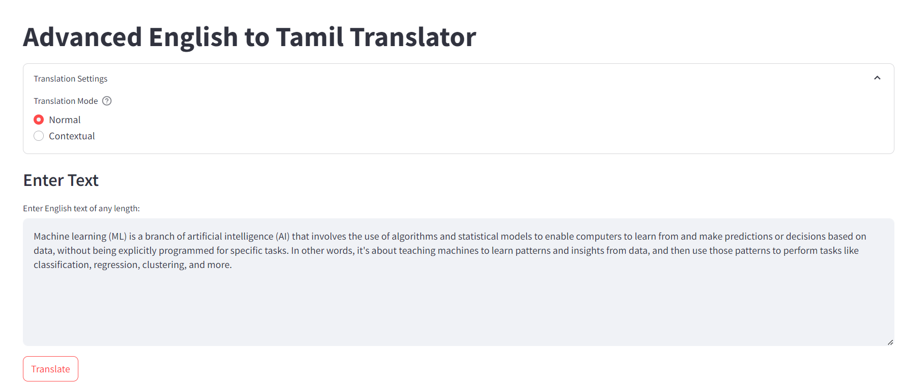
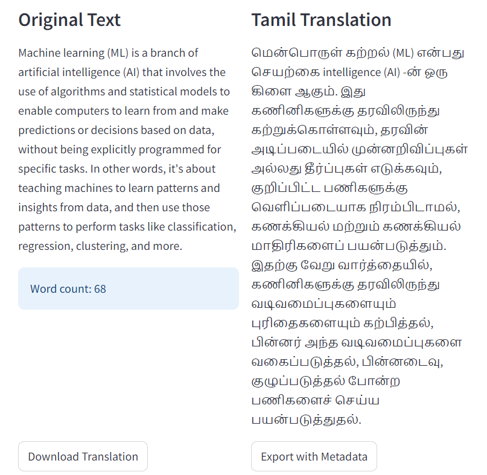
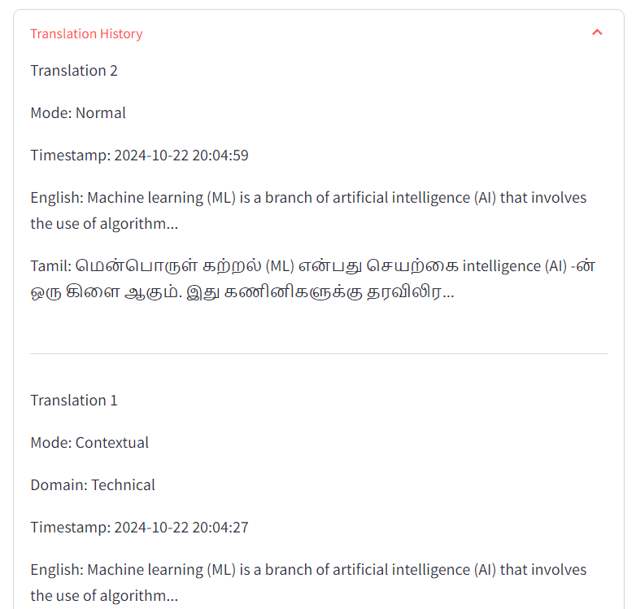
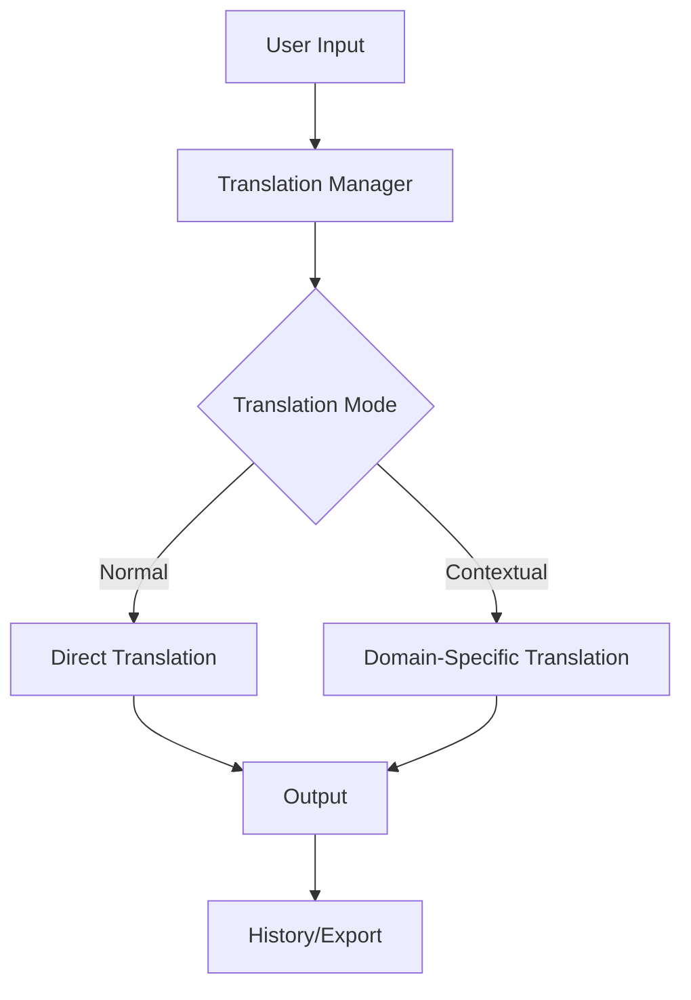

# 🌏 English to Tamil Translator App


## 📝 Description

A powerful Streamlit-based application that provides English to Tamil translation with two specialized modes: normal translation and contextual translation. Built using the Groq API and Llama 3.2 model for accurate translations.




## ✨ Features

- 🔄 Two Translation Modes:
  - 📝 Normal Translation
  - 🧠 Contextual Translation with domain awareness
- 📚 Multiple Domain Support:
  - Technical
  - Medical
  - Legal
  - Literary
  - Business
  - Academic
- ♾️ Unlimited Text Length Support
- 📜 Translation History
- 💾 Export Options with Metadata
- 🎯 Progress Tracking

## 🖥️ Screenshots

### Normal Translation Mode

<!-- Add screenshot of normal translation mode -->


### Translation History

<!-- Add screenshot of translation history -->

## 🚀 Getting Started

### Prerequisites

- Python 3.8 or higher
- Groq API key
- Git

### Installation

1. **Clone the repository**
```bash
git clone https://github.com/YOUR_USERNAME/tamil-translator.git
cd tamil-translator
```

2. **Create and activate virtual environment**
```bash
# Windows
python -m venv venv
venv\Scripts\activate

# Linux/Mac
python -m venv venv
source venv/bin/activate
```

3. **Install dependencies**
```bash
pip install -r requirements.txt
```

4. **Set up environment variables**
Create a `.env` file in the project root:
```plaintext
GROQ_API_KEY=your_groq_api_key_here
```

5. **Run the application**
```bash
streamlit run translator2.py
```

## 💻 Usage

1. Select translation mode (Normal/Contextual)
2. Choose domain (for contextual translation)
3. Enter English text
4. Click "Translate"
5. Download or copy the translation


## 🛠️ Technical Architecture



## 📱 Application Structure

```
tamil-translator/
├── translator2.py        # Main application file
├── .env                 # Environment variables
├── requirements.txt     # Dependencies
├── README.md           # Documentation
└── screenshots/        # Application screenshots
    ├── banner.png
    ├── main-interface.png
    ├── normal-translation.png
    ├── contextual-translation.png
    ├── history.png
    └── usage-guide.png
```


## 🤝 Contributing

1. Fork the repository
2. Create your feature branch (`git checkout -b feature/AmazingFeature`)
3. Commit your changes (`git commit -m 'Add some AmazingFeature'`)
4. Push to the branch (`git push origin feature/AmazingFeature`)
5. Open a Pull Request


## 🙏 Acknowledgments

- Groq API for providing the translation capabilities
- Streamlit for the web interface framework
- Gemma2 model for accurate translations


